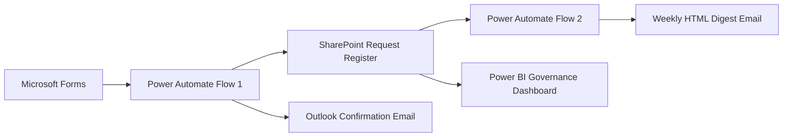

# Business Request Intake and Reporting Automation

An end-to-end Microsoft 365 workflow prototype that captures internal business requests, stores them in a centralized SharePoint register, sends automated confirmation emails, distributes scheduled request digests, and reports governance KPIs through Power BI.

## Project Overview

Business requests are often received through scattered channels such as email, messages, forms, and spreadsheets. This can lead to incomplete information, inconsistent tracking, delayed acknowledgements, and time-consuming reporting.

This project replaces that fragmented process with a structured request-intake and reporting workflow using Microsoft Forms, Power Automate, SharePoint, Outlook, and Power BI.

## Business Problem

The existing manual process presents several challenges:

- Requests arrive through multiple channels.
- Important request information may be missing.
- Data must be manually copied into tracking sheets.
- Requesters may not receive timely confirmation.
- Status reporting requires repetitive manual effort.
- Management lacks a consolidated view of request volume, priority, status, and deadlines.

## Proposed Solution

The implemented workflow:

1. Captures structured requests through Microsoft Forms.
2. Retrieves form responses using Power Automate.
3. Creates a corresponding record in a SharePoint list.
4. Uses the SharePoint-generated ID as the unique Request ID.
5. Sends an automated confirmation email to the requester.
6. Retrieves SharePoint records on a weekly schedule.
7. Converts request data into a structured HTML digest.
8. Sends the digest to the designated stakeholder.
9. Connects the SharePoint register to an interactive Power BI dashboard.

## System Architecture



## Implemented Workflows

### PA01 — Business Request Intake and Confirmation

This automated cloud flow:

1. Triggers when a new Microsoft Forms response is submitted.
2. Retrieves the submitted response details.
3. Creates a new item in the SharePoint Business Request Register.
4. Stores requester, business unit, request type, priority, deadline, and business need.
5. Assigns the default status `Submitted`.
6. Sends a confirmation email containing the SharePoint-generated Request ID.

### PA02 — Weekly Business Request Digest

This scheduled cloud flow:

1. Runs once every week.
2. Retrieves request records from SharePoint.
3. Selects the required reporting fields.
4. Creates a structured HTML table.
5. Sends the weekly digest through Outlook.

## Power BI Governance Dashboard

The Power BI dashboard provides visibility into:

- Total requests
- Open requests
- Completed requests
- High and critical requests
- Overdue requests
- Requests by business unit
- Requests by priority
- Requests by status
- Requests by request type
- Request ownership and target dates
- Interactive filtering through slicers
- Conditional formatting for operational review


## Dashboard Measures

Examples of DAX measures used in the dashboard:

```DAX
Total Requests =
COUNTROWS('Business Request Register')
```

```DAX
Open Requests =
CALCULATE(
    [Total Requests],
    'Business Request Register'[Status] <> "Completed",
    'Business Request Register'[Status] <> "Rejected"
)
```

```DAX
High or Critical Requests =
CALCULATE(
    [Total Requests],
    'Business Request Register'[Priority] IN {"High", "Critical"}
)
```

```DAX
Overdue Requests =
CALCULATE(
    [Total Requests],
    'Business Request Register'[Target Date] < TODAY(),
    'Business Request Register'[Status] <> "Completed",
    'Business Request Register'[Status] <> "Rejected",
    NOT ISBLANK('Business Request Register'[Target Date])
)
```

## Functional Specification

A functional specification was created before development to document:

- Business problem
- Project objective
- Project scope
- Stakeholder roles
- As-is process
- To-be process
- Functional requirements
- Business rules
- Data fields
- Acceptance criteria
- Success measures

The specification is available in the `Functional specification` directory.

## User Acceptance Testing

The workflow was tested using synthetic business-request records.

The UAT document covers:

- Required-field validation
- Microsoft Forms submission
- Forms-to-SharePoint data transfer
- Unique Request ID generation
- Confirmation-email delivery
- Scheduled digest generation
- Power BI data refresh
- Dashboard reporting accuracy

The testing evidence is available in the `Test_evidence` directory.

## Technology Stack

- Microsoft Forms
- Microsoft Power Automate
- Microsoft SharePoint
- Microsoft Outlook
- Microsoft Power BI
- Microsoft Excel
- DAX
- Power Query

## Repository Structure

```text
Enterprise Request Automation/
│
├── Form/
│   └── Form Screenshot.png
│
├── Functional specification/
│   └── Functional specification document
│
├── Power_Automate/
│   ├── PA01 workflow export
│   ├── PA01 workflow evidence
│   ├── PA02 workflow export
│   └── Weekly digest evidence
│
├── PowerBI/
│   ├── Dashboard.pbix
│   └── Dashboard Overview.png
│
├── Sharepoint_Evidence/
│   └── Business Request Register evidence
│
├── Test_evidence/
│   └── UAT test document
│
├── .gitignore
└── README.md
```

## Key Skills Demonstrated

- Business requirements analysis
- Functional specification development
- Business-process automation
- Microsoft 365 integration
- Power Automate cloud flows
- SharePoint list design
- Automated email communication
- Scheduled reporting
- Power BI dashboard development
- DAX measure creation
- Power Query data transformation
- User acceptance testing
- Process documentation

## Project Limitations

- This is a portfolio prototype and not a production deployment.
- The project uses synthetic business-request records.
- Priority-based escalation was excluded from the final stable workflow.
- AI summarization was not embedded into the final automation.
- Enterprise security, data-loss prevention, access control, retention, and compliance policies would require additional organizational configuration.
- No quantified time-saving claim is made because a controlled manual-versus-automated comparison was not performed.

## Possible Future Enhancements

- Priority-based routing and escalation
- Automatic owner assignment
- Approval workflows
- Microsoft Teams notifications
- AI-generated management summaries
- Role-based SharePoint access
- SLA monitoring
- Automated overdue reminders
- Power BI Service scheduled refresh
- Dataverse migration for larger-scale deployments

## Author

**Aamena Sheikh**

- GitHub: [aamenasheikh27](https://github.com/aamenasheikh27)
- LinkedIn: [aamena-sheikh](https://www.linkedin.com/in/aamena-sheikh/)
